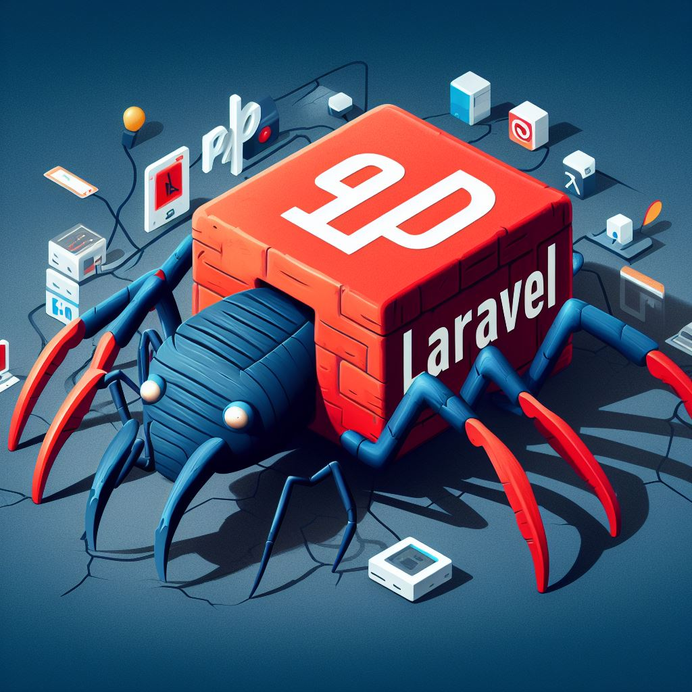

<p align="center">
  <a href="" rel="noopener">
 </a>
</p>

<h3 align="center">Laravel News Crawler API</h3>

<div align="center">

[]()
[](https://github.com/afshin-phpy/The-Documentation-Compendium/issues)
[](https://github.com/afshin-phpy/The-Documentation-Compendium/pulls)
[](/LICENSE)

</div>

---

<p align="center"> This API allows you to fetch and manage news articles from various sources.
    <br> 
</p>

## 📝 Table of Contents

- [About](#about)
- [Getting Started](#getting_started)
- [Built Using](#built_using)
- [Authors](#authors)
- [API-Endpoints](#api)

## 🧐 About <a name = "about"></a>

Laravel News Crawler API is a web application that crawls and aggregates news articles from various sources, such as NewsAPI, Guardian API, and Mediastack API, and stores them in a database. It provides a RESTful API to access the news data.

## 🏁 Getting Started <a name = "getting_started"></a>

To install and run this project, you will need to have Docker and Composer installed on your machine. Then, follow these steps:

1. Clone this repository to your local machine.
2. Copy the .env.example file to .env and fill in the required variables, such as the API keys for the news sources.
3. Run composer install to install the PHP dependencies.
```
composer install
```
4. Run ./vendor/bin/sail up to start the Docker containers.

```
./vendor/bin/sail up -d
```

5. Run ./vendor/bin/sail artisan migrate to create the database tables.

```
./vendor/bin/sail artisan migrate
```

6. Run ./vendor/bin/sail artisan queue:work to start the queue worker.

```
./vendor/bin/sail artisan queue:work
```

7. Run ./vendor/bin/sail artisan schedule:run to start the scheduler that fetches data from the news sources every hour.

```
./vendor/bin/sail artisan schedule:run
```

### Sail alias

To add the ./vendor/bin/sail directory to your bash environment, you can modify your shell configuration file. If you're using Bash, it's likely that you have a .bashrc or .bash_profile file in your home directory. Here's how you can add the ./vendor/bin/sail directory to your PATH:

 1. Open your shell configuration file in a text editor. Use one of the following commands based on your shell:

```
nano ~/.bashrc
```
2. Add the following line at the end of the file:
```
alias sail='bash ./vendor/bin/sail'
```
 3. Save the file and exit the text editor.

 4. To apply the changes immediately, you can either restart your terminal or run the following command:

 ```
 source ~/.bashrc   # for Bash
 ```

Now, you should be able to use sail commands from anywhere in your terminal.


## 🔧 Running the tests <a name = "tests"></a>

You can use following code to run testcases:

```
sail artisan test
```


## ⛏️ Built Using <a name = "built_using"></a>

- [Laravel 10.x](https://www.Laravel.com) 
- [MySQL Database](https://www.mysql.com/)
- [Laravel Sail](https://laravel.com/docs/10.x/sail)
- [Laravel Queue](https://laravel.com/docs/10.x/queues)
- [News API](https://newsapi.org/)
- [Guardian API](https://open-platform.theguardian.com/documentation/search)
- [Mediastack API](https://mediastack.com/documentation)

## ✍️ Authors <a name = "authors"></a>

- [@afshin-phpy](https://github.com/afshin-phpy) - Idea & Initial work


## 🚀 API-Endpoints <a name = "api"></a>

The API provides the following endpoints:

- GET /api/news: Returns a paginated list of all news articles in the database, with optional filters by source, category, language, and country.
- GET /api/news/{id}: Returns a single news article by its id.
- GET /api/sources: Returns a list of all news sources that are supported by the project. 

